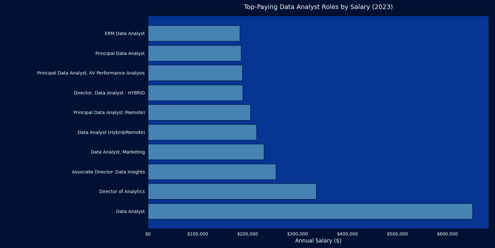
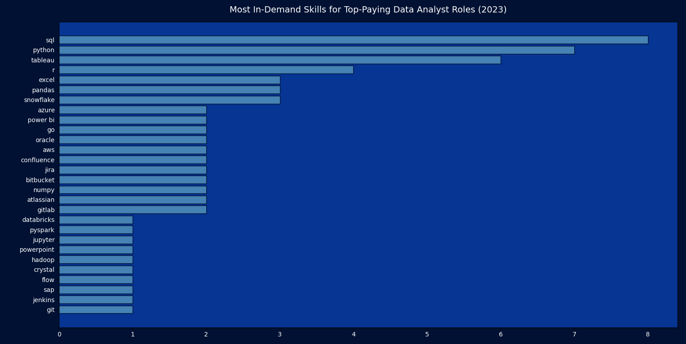
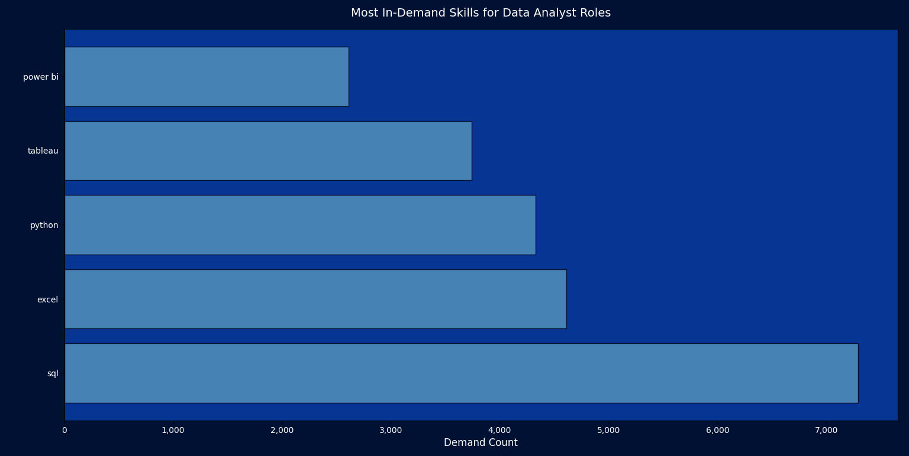
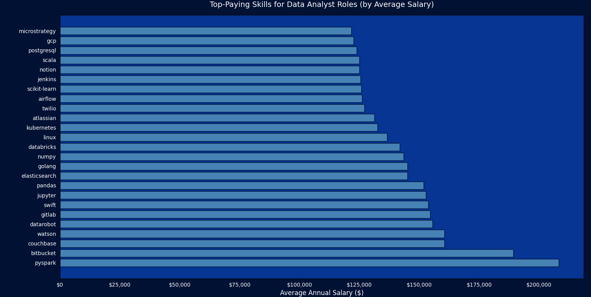
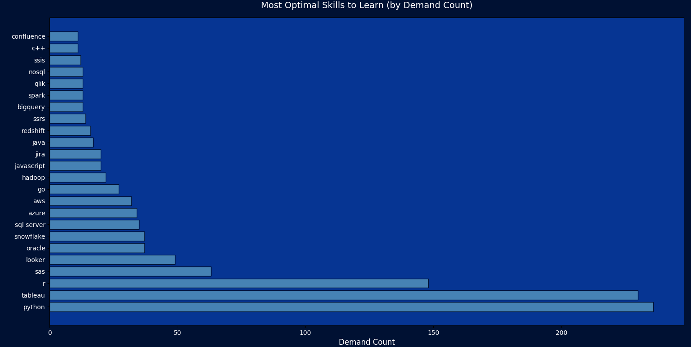

# Introduction

📊 Dive into the data job market! focusing on data analyst roles, this project explores
💰 top-paying-jobs,in-demand skills,📈 where high demands meets high salary in data analystics 💡.

SQL queries ? check them out here : [project sql folder](/project_sql/)

# Background

Driven by a guest to navigate the data analyst job market more effectively , this project was born from a desire to pinpoint top-paid and in-demand skills, stremlinig others work to find optimal jobs.

### the question i answered through my sql queries were :

1. what are the top-paying data analyst jobs?
2. what skills are required fro these top-paying jobs?
3. what skills are most in demand for data analysts?
4. which skills are associated with higher salaries?
5. what are the most optimal skills to learn?

# Tools i used

for my deep dive into the data analysis job market, i harnessed the power of several key tools:

- **SQL**: the backbone of my analysis , allowing me to query the database and unearth critical insights.
- **PostgreSQL**: the chosen database management system , ideal for handling the job posting data.
- **Visual Studio Code**: My go-to for database management and executing SQL queries.
- **Git & GitHub**: Essential for version control and sharing my SQL scripts and analysis , ensuring collaboration and project tracking.

# The Analysis

Each query for this project aimed at investigating specific aspects of the data analyst job market.
here's how i approached each question :

### 1.top paying Data Analyst jobs

to identify the highest-paying roles , i filtered the data anlyst positions by average yearly salary and location , focusing on remote jobs. this query highlights the high paying opportinuities in the field.

```sql
SELECT
    job_id ,
    job_title,
    job_location,
    job_schedule_type,
    salary_year_avg,
    job_posted_date,
    name as company_name
FROM
    job_postings_fact
LEFT JOIN company_dim on job_postings_fact.company_id = company_dim.company_id
WHERE
    job_title_short = 'Data Analyst' AND
    job_location='Anywhere' AND
    salary_year_avg IS NOT NULL
ORDER BY salary_year_avg Desc
LIMIT 10 ;
```

here's the breakdown of the top data analyst jobs in 2023 :

- **Wide salary range:** top 10 paying data analyst roles span from $184,000 to $650,000 ,including significant salary potential in the field.
- **Diverse Employers:** Companies like SmartAsset , Meta , and AT&T are among those offering high salacies m showing a broad interest across different industries.
- **Job Title Variety:** there's a high diversity in job titles , from Data Analyst to Director of Analytics , reflecting Varied roles and specializations within data analytics.

Bar graph visualizing the salary for the top salaries for data analysts ; **i generated this with python libraries like matplotlib and pandas**

#

### 2.top paying job skills

Objective: To analyze how specific skills contribute to high-paying roles across different companies and job titles.

```sql
with top_paying_jobs as(
SELECT
    job_id,
    job_title,
    salary_year_avg,
    name as company_name
FROM
    job_postings_fact
LEFT JOIN company_dim ON job_postings_fact.company_id = company_dim.company_id
where
     job_title_short = 'Data Analyst' AND
     job_location='Anywhere' AND
     salary_year_avg IS NOT NULL
ORDER BY salary_year_avg DESC
limit 10
)
select
    top_paying_jobs.*,
    skills
from top_paying_jobs
INNER JOIN skills_job_dim on top_paying_jobs.job_id = skills_job_dim.job_id
inner join skills_dim on skills_job_dim.skill_id = skills_dim.skill_id
ORDER BY salary_year_avg Desc;
```

- **Skill Combinations Matter:** High-paying roles like AT&T's Associate Director ($255,830) require diverse skill stacks including SQL, Python, cloud platforms, and big data tools.

- **Industry-Specific Demands:** Pinterest's Marketing Data Analyst role values Hadoop alongside SQL and Python, while healthcare roles emphasize Crystal and Oracle.

- **Leadership Skill Requirements:** Director-level positions require both technical skills (SQL, Python) and workflow tools (Jenkins, Bitbucket, Jira).

- **Emerging Technology Integration:** Roles at companies like Motional and SmartAsset include Go, Snowflake, and GitLab, showing adoption of modern development practices.

**Key Insight: The highest salaries go to professionals who combine traditional analytics skills (SQL, Python) with specialized tools relevant to their industry and modern development workflows.**

Bar graph visualizing the skills for top paying roles in data analysis field ; **i generated this with python libraries like matplotlib and pandas**


#

### 3.most in demand Skills

Objective: To identify the most frequently requested skills in data analyst job postings, helping job seekers prioritize their learning

```sql
select
skills,
count(skills_job_dim.job_id) as demand_count
from job_postings_fact
INNER JOIN skills_job_dim on job_postings_fact.job_id = skills_job_dim.job_id
INNER JOIN skills_dim on skills_job_dim.skill_id = skills_dim.skill_id
WHERE job_title_short = 'Data Analyst' and job_work_from_home=TRUE
GROUP BY skills
ORDER BY demand_count desc
limit 5;
```

- **SQL Dominance:** SQL emerges as the clear leader with 7,291 mentions, underscoring its fundamental importance in data extraction and manipulation.

- **Core Technical Stack:** Excel (4,611), Python (4,330), and Tableau (3,745) form the essential toolkit for modern data analysts.

- **Visualization Importance:** Both Tableau and Power BI (2,609) show strong demand, highlighting the critical need for data storytelling and visualization skills.

- **Significant Skill Gaps:** The demand count drops significantly from SQL to Excel, indicating potential opportunities for professionals who master the top skills.

**Key Insight: Mastering SQL provides the strongest foundation, while complementing it with Python and visualization tools creates the most marketable skill set.**

Bar graph visualizing the most in demand skills for data analysts ; **i generated this with python libraries like matplotlib and pandas**


#

### 4.top skills based on salary for my role

Objective: To identify which technical skills correlate with the highest compensation in data analyst roles.

- **Big Data Premium:** PySpark leads with $208,172, showing the high value placed on big data processing and distributed computing skills.

-**Development Tools Value:** Bitbucket ($189,154) and specialized databases like Couchbase and Watson ($160,515) command premium salaries.

- **Machine Learning Focus:** DataRobot ($155,485), GitLab ($154,500), and Jupyter ($152,776) demonstrate the salary benefits of ML and development workflow expertise.

-**Cloud & Infrastructure:** Databricks, Linux, and Kubernetes all show salaries above $130,000, indicating the premium for cloud and infrastructure skills.

**Key Insight: Specialized big data tools and development workflow technologies offer the highest salary returns, often exceeding traditional analytics tools.**

Bar graph visualizing top skills based on salary ; **i generated this with python libraries like matplotlib and pandas**


#

### 5.most optimal skill to learn

Objective: To identify skills that balance both high demand and attractive compensation, providing the best return on learning investment.

- **High Value Niche Skills:** Go programming leads with $115,320 despite moderate demand (27), showing premium value for specialized expertise.

- **Cloud Platform Dominance:** Snowflake, Azure, and AWS all show strong salaries ($108,000-$113,000) with solid demand (32-37 positions).

- **Traditional Tools Persistence:** Python and Tableau show massive demand (236 and 230 respectively) with respectable salaries around $100,000.

- **Enterprise Tool Value:** Oracle, Looker, and SAS maintain strong positions with good balance of demand and compensation.

**Key Insight: Cloud data platforms (Snowflake, Azure, AWS) offer the optimal balance of high salaries and strong market demand.**

Bar graph visualizing most optimal skills to learn ; **i generated this with python libraries like matplotlib and pandas**


# What I Learned

through this adventure , i've turbocharged my SQL toolkit with some serious firepower:

- **complex query crafting:** mastered the art of advanced sql , merging tables like a pro and wielding with clauses for ninja-level temp table maneuvers.
- **Data aggregation:** got crazy with group by and turned aggregate functions like count()
  and avg() into my data-summarizing sidekicks.
- **Analytical wizardry:** leveled up my real-world puzzle-solving skills, turning questions into actinoable ,insightful sql queries .

# Conclusions

1. **Top-Paying Data Analyst jobs:**
   the highest-paying jobs for data analysts that allow remote work offer a wide range of salaries , the highest at $650,000.

2. **skills for top-paying jobs:** high-paying data analysts jobs require advanced proficiency in SQL , suggesting it's a critical skill for earning a top salary.

3. **Most in-demand skills:** SQL is also the most demand skill in the data analyst job market , thus making it essential for job seekers.

4. **skills with higher salaries:** specialized skills , such as SVN and solidity ,are associated with the highest average salaries , indicating a premium on niche expertise.

5.**optimal skills for job market value:** SQL leads in demand and offers for a high average salary , positioning it as one of the most optimal skills for data analysts to learn to maximize their market value.
